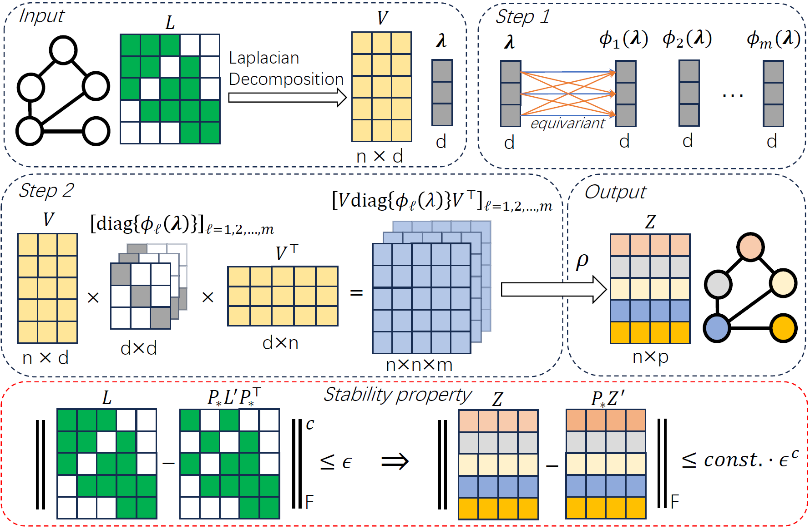

# On the Expressivity of Stable Positional Encodings for Graph Neural Networks

## About

This is the official code for the paper "On the Expressivity of Stable Positional Encodings for Graph Neural Networks". 

Feel free to contact yinan8114@gmail.com if there is any question.



## Code usage

To reproduce experiments on ZINC, cd to ./zinc and run
```
python runner.py --config_dirpath ../configs/zinc --config_name SPE_gine_gin_mlp_pe37.yaml --seed 0
```


To reproduce experiments on Alchemy, cd to ./alchemy and run
```
python --config_dirpath ../configs/alchemy --config_name SPE_gine_gin_mlp_pe12.yaml --seed 0
```

To reproduce experiments on DrugOOD, cd to ./drugood and run
```
python --config_dirpath ../configs/assay --config_name SPE_gine_gin_mlp_pe32_zeropsi.yaml --dataset assay --seed 0
python --config_dirpath ../configs/scaffold --config_name SPE_gine_gin_mlp_pe32_standard_dropout.yaml --dataset scaffold --seed 0
python --config_dirpath ../configs/scaffold --config_name SPE_gine_gin_mlp_pe32_standard_dropout.yaml --dataset size --seed 0
```

To reproduce substructures counting, cd to ./count and run
```
bash run.sh
```
